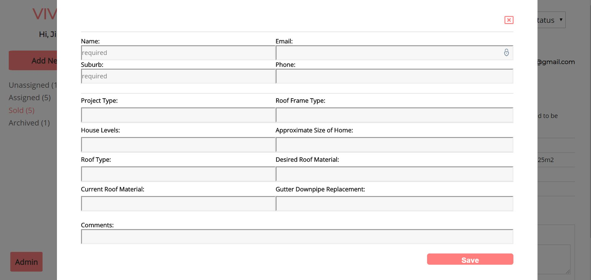

# Vivify CRM

Built with blood sweat and tears by Jing Li, Mark Butcher, and Andrew Sims

https://vivify-roofing.netlify.com/

Link to GitHub repository:
https://github.com/jliclaire/MERN_Vivify_Roofing_frontend
https://github.com/jliclaire/MERN_Vivify_Roofing_backend

## Description

This software is a basic CRM (customer relationship management) system
which was built for a roof restoration business.

### Problem definition

The business problem that this is supposed to solve is that of standardising
the sales procedure.

Irregularities and lack of system around the sales procedure and
communication between the trades and sales staff had meant that
mistakes were often made and jobs misquoted. This is a risk and an opportunity to both the
reputation and bottom line of the business.

A significant aspect of this problem was that communication and record-keeping
was done on an ad hoc basis. Therefore, having all the information regarding
the customer and their particular needs in a centralised hub was meant to
improve this situation and improve communication between the trades and the
sales team more generally.

### Functionality

Our functionality follows from the above two business problems. In the first
place, we want the software to centralise information regarding customer leads
and the development of these over the sales lifecycle, as well as to standardise
interactions and processes concerning the potential customer.

This functionality is covered in the **Dashboard** of the software. An **Admin User** on the dashboard can see all the sales **Leads** and sorted them by their current status in the sales lifecycle, allowing **Admin Users**  to have the complete control. 

Clicking on a **Lead** will display contact information for the potential customer and the details of the job.

Sales leads can be assigned to **Sales Users** whose responsiblity it then is
to follow up with the lead in order to quote and potentially sell the job. At
this stage the Lead is marked as "in progress."
Once in contact with the customers they are required to submit **Followups** using
the HTML forms which are attached to the **Lead** as a record of the sales
attempt. The Sales Users can also provide more unforseen details about the job
and provide the price for which they have sold it. Once this occurs the job is
marked as "sold."

The second piece of functionality, the analytics, is covered in the **Admin**
section of the software. Here an Admin User can find information about what kinds
of jobs they have been able to sell, who has been selling them, how much they
have been sold for, and where they have been sold.


### Technology Stack

The software was built using full-stack Javascript: React on the frontend, and
Express and NodeJS on the backend. We use MongoDB for data persistence. The
software is deployed on Netlify (front) and Now (back).

## Installation and usage

### Set up

when run locally, run below commands from the terminal

Frontend & Backend

`npm install`

`npm start`

Frontend

`npm install`

`npm run build`

`npm start`

### Configure

Configure environmental variables

Frontend:

1. create `.env.development` in the root path with below code

```
REACT_APP_API_URL=<backend development url>
```

2. create `.env.production` in the root path with below code

```
REACT_APP_API_URL=<backend production url>
```

Backend:

1. `.env` file to store

```
- DB_URL=<local mongodb url>
- JWT_SECRET=<JWT secret>
- CLOUDINARY_CLOUD_NAME=<Cloudinary user name>
- CLOUDINARY_API_KEY=<Cloudinary api key>
- CLOUDINARY_API_SECRET=<Cloudinary api secret>
```

2. create `now.json` file in the root path with below code

```
{
  "name": "vivify-roofing",
  "alias": "vivify-roofing",
  "env": {
    "DB_URL": __replace with "MongoDB Atlas URL"__
  },
  "version": 2,
  "builds": [{ "src": "server.js", "use": "@now/node-server" }],
  "routes": [{ "src": "/(.*)", "dest": "server.js" }]
}
```

### Deploy

#### Front-end Deploy

React frontend is deployed on Netlify. run below command to deploy the application

`npm run build`

`netlify deploy` --deploy path (./build)

`netlify deploy --prod` --deploy path (./build)

#### Back-end Deploy

NodeJS and ExpressJS backend is deployed with Now. run below command to deploy the application

`now`

### Use

#### Account and Dashboard

1. User to register an account
2. User to login to their account to view the dashboard.
3. The dashboard has three section. A side bar to categorize different leads according to the status of it. A lead list to show all the leads in that category and an individual lead section to show the lead that has been set to active by clicking the item on the lead list.


<p>


</p>

#### Add new lead

1. User can create new lead by clicking the "Add New Lead" button from the side bar. A popup window with a new lead form will show and prompt the user to fill related field with customer information. Click Save button to save the new lead or click X button to close the form. After form saved, new lead information will be added and showed on top of the lead list view.



#### Add follow up

1. User to click a lead from the lead list to review the details of the lead information
2. User can use "Add Follow Up" form to add comments. A checklist popup window will show after clicking "Add Quote" button. A user has to choose a roof type to see the correspond checklist. after all checklist items are checked, a user will be able to input the quotation amount and proceed to the next field of the follow up form.
3. A user can upload photos by clicking the "choose file" button to choose images from local image storage.
4. Click the "Add Follow Up" button to add the follow up information to show in the follow up section of the individual lead show view.


#### Edit lead info

There are two parts of lead info that can be edited by a user: customer enquiry and followups

Part 1: Lead info filled by customer enquiry

1. Click the "Edit" button on the top of customer information section. A form populated with data sent from the customer can be edited by the user. After clicking the "Save" button when finalized editing, the screen will show the updated information.


Part 2: Followup info filled by sales trade

1. Click the "Edit" button on the bottom of the followup that need to be edited. A form will be show which enables the user to edit the followup comment. After editing the comment, click "Save" to show the updated followup.


#### Assign lead

1. An admin user can select a trade person from the "Assign to" drop list to assign a lead to a sales person. By doing so, the sales person can login to their account and view this lead info, however, other sales person will not see this lead info from their dashboard.
2. A lead's status can be changed by choose a category from the "Mark as" drop list. By doing so, a lead can be moved to the its category and can be found and viewed from the side bar menu.


## Design documentation

### Design process

### User stories

### Workflow diagram

### Wireframes

### ERDs


### Data flow diagram

### OO design documentation

## Project Management and Planning process

### Project plan and timeline

Week 1:

- Design wireframes and mockups, color scheme, fonts
- Mongoose data structure design, build
- GitHub frontend and backend, install dependencies
- MongoDB Atlas setup
- Assign tasks
- Interview with client
- Setup backend CRUD end points
- Frontend routes setup

Week 2:

- Setup Authentication endpoint
- Create login and register account pages
- Frontend token connect to backend authentication
- React frontend for dashboard
- Divide dashboard sections
- show sidebar, lead list and lead view
- Sidebar category
- Add followup form, edit enquiry and followup function
- Add upload images function
- Backend testing
- Mobile responsive design

Week 3:

- Create add new lead function
- Update dashboard after editing form submitted
- Assign lead to different users
- Move leads to different sidebar category after marking lead status
- Frontend testing
- Write README
- Submission
- Presentation

### Client communications


### Trello screenshots


## Short answer questions

1. What are the most important aspects of quality software?

There are at least four core "most" important aspects of quality software. The
first aspect is that it satisfies the logic of the business problem which it
aims to solve. Software is poor quality if it is badly suited to its real world
problem, or if it approaches this problem with an eccentric or overly complicated
logic.

The second aspect is that of reliability. Software should be reliable, in the
sense that it can be used in the same way on different occasions and still yield
the same result, and that it does not break or work in unintended ways.
Reliability can be ensured by thorough testing and error handling.

The third aspect is separation of concerns. A piece of software separates its
concerns when it is well modularised so that each part of the software only
fulfils its own function and is not overly entangled with the other parts.
Software that separates its concerns is more easily extensible than software
which does not.

The final aspect is that of scalability. Quality software can work in production
contexts where the load on the system may be much higher than in development
contexts.

2. What libraries are being used in the app and why?

We used third-party dependencies on both front-end and back-end.

### Frontend

- React: create-react-app and its dependencies (webpack, babel, etc.) are used
  in order to streamline the process of writing our UI.

- Axios: used in order to make calls to our server and to other APIs, since it
  is more straightforward to use than the native fetch.

- Testing libraries: we use Jest and react-testing-library to test our UI. We
  use Jest because it is intended specifically for DOM testing with React and we
  use react-testing-library because its API is more straightforward and offers
  less opportunity for errors of inexperience than does Enzyme.

- Dotenv: to store secrets in the environmental variables.

- Netlify-CLI: to facilitate deployment.

- React-Router-DOM: to allow endpoints on the client side.

### Backend

- Express: to provide the tools to build our webserver.

- BCrypt: to hash passwords and compare hashes.

- Cloudinary: to facilitate image upload.

- CORS: to set Cross Origin Request settings.

- JSONWebTokens: to create and check tokens for authentication.

- Mongoose: as the model over our database.

- Multer: to buffer image uploads on their way to the cloudinary API.

- Mocha and Chai: for backend testing.

- Nodemon: to enable hot reloading of the server.

3. A team is about to engage in a project, developing a website for a small business. What knowledge and skills would they need in order to develop the project?

There are a number of skills and knowledges that are necessary to develop a
website. These are both technical and organisational. The organisational
skills involve knowing the software development cycle and the team practices
that surround this (e.g., Agile). Some design skills or knowledge would also
be useful for the planning of the website and UX (e.g., wireframing).

The technical skills involve the three languages of the browser: HTML, CSS, and
JavaScript. These languages are those which are used to develop on the client
side. If the website also includes server-side code, then the developers might
also want to know a server-side language such as Ruby, PHP, or NodeJS.

If the website also requires the persistence of data, then the team might also
be required to use some sort of database technology, such as MongoDB or
PostgreSQL.

4. Within your own project what knowledge or skills were required to complete the project, and overcome challenges?

As above, we required to draw upon both technical and organisational knowledge
and skills. Firstly, we needed to apply what we had learned about producing a
MERN stack application. This included knowing how to write code and solve
problems in Javascript, but also specific knowledge about APIs, authentication
and authorisation, databases, and Web/Browser APIs.

General progamming skills were very helpful in order to debug or to resolve
issues after the code had been written. These skills allowed us to quickly isolate
and fix bugs in our code.

Organisation-wise, we needed to know how to effectively delegate tasks in order
to take advantage of our strengths and weaknesses and complete the work to a
high standard in the time alotted.

5. Evaluate how effective your knowledge and skills were this project, using examples, and suggest changes or improvements for future projects of a similar nature.

````

```

```
````
